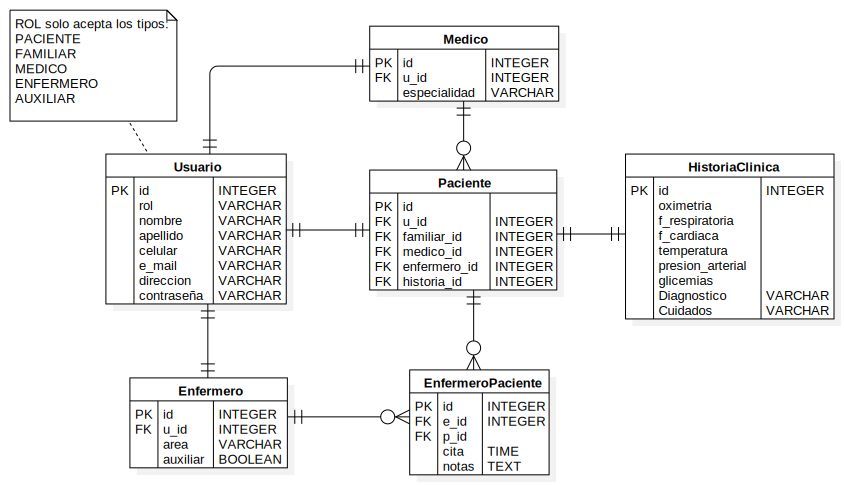

# be_hospitalEnCasa
Backend para el proyecto de Hospitalización en casa trabajado en el marco del ciclo 3 del programa Misión TIC. 2022.
### Tecnologías:  
- Python
- Django REST Framework
- Base de datos Postgres
---
## ERD

---
## ToDo
- [x] Setup inicial del proyecto
- [ ] Explicar modelo de datos
- [ ] Incluir el código de JWT (autenticación)
- [ ] Modelos
- [ ] Migraciones (base de datos local)
- [ ] URLs
- [ ] Vistas y serializadores
- [ ] Migración a Heroku
---
### Notas
Para verificar las librerias desactualizadas en el entorno virtual usar `pip list --outdated`, y para actualizarlas a la última versión `pip install -U package_name`.  
Para actualizar el *listado* de librerias instaladas en el entorno virtual usar `pip freeze > requirements.txt`.
